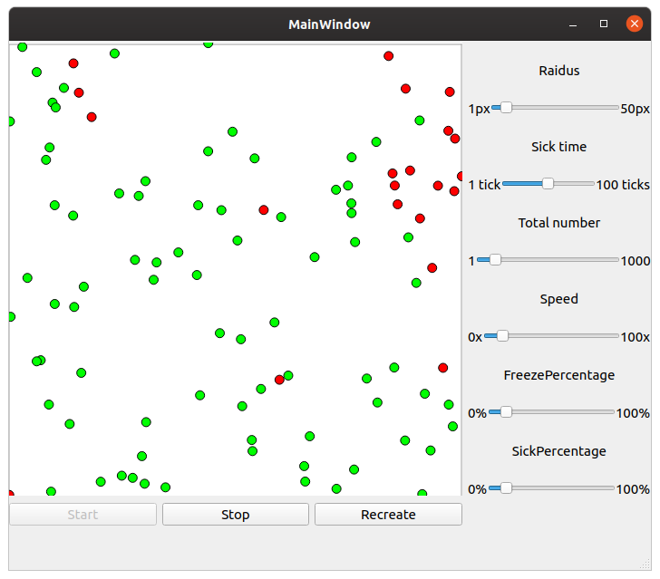
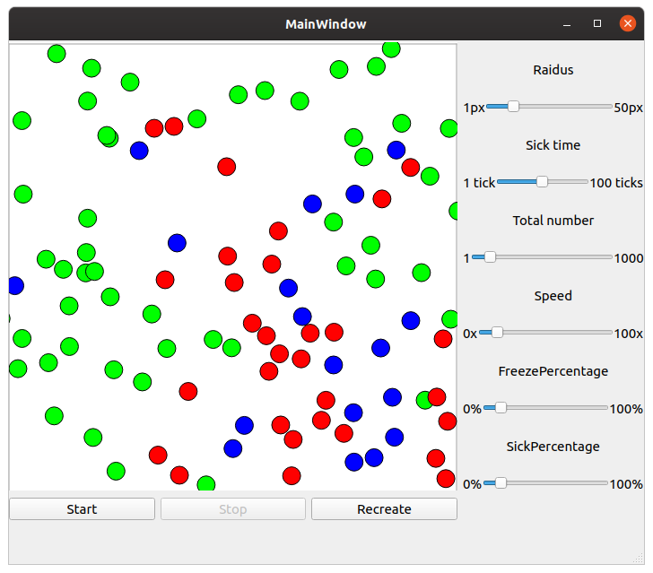

COVID-19 simple simulations
==============

Small pet project based on **Washington post** article about COVID-19 propagation and cartantine results in China.

Why?
----
Just for fun.

Dependencies
-----
The only dependency is **Qt**. Tested on **5.13.2+**.
Also **C++17** is enabled by **default**.

Build
-----
**Minimal** build example via **console**.
```c++ based
mkdir build
cd build
cmake .. -G Ninja -DCMAKE_PREFIX_PATH=<path-to-qt>
ninja
```

Description and params
----
The model is based on elastic collisions in a closed volume.
It is believed that people move at a certain speed,
and in case of contact between the infected and healthy,
with some probability infection occurs.

`Radius` - The radius of infection, or rather the distance of the virus acts on a person.
`Sick time` - The amount of a time(in ticks of delta T) until person fully recovers.
`Total number` - Total number of subjects(people) in model.
`Speed` - Multiplier of subjects move speed.
`Freeze percentage` - Amount of people, who are freeze(doesn't move on a field).
`Sick percentage` - Amount of people, who are infected in the time simulation starts.

TODO
----
* Add real **WHO** and **distributions** params values.
* **Parallelism**, to speed up calculation. Right now, it works on **O(n^2)** algorithm.
* **Additional statistics** to draw a plots with a **distributions** and **extrapolations**.
* ~~Death simulations, like in real world.~~


Screenshots
----



